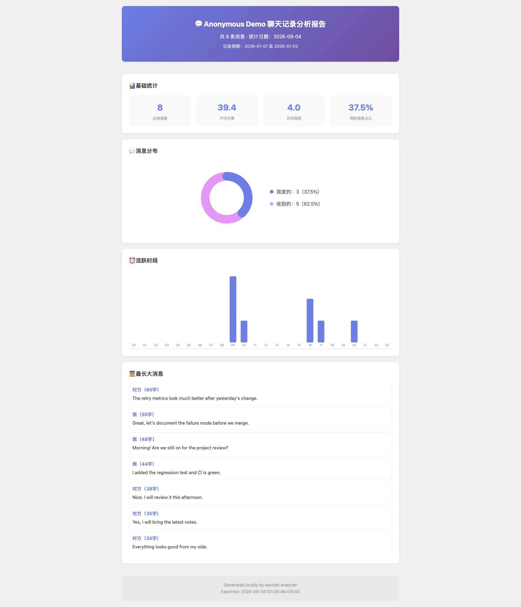

# wechat-analyzer

A local-first Go CLI for turning exported WeChat conversations into useful statistics, visual reports, and optional LLM-assisted personality analysis.

`wechat-analyzer` reads JSON exported by `wechat-export`, computes conversation statistics locally, and can generate self-contained HTML reports. AI analysis is optional and is routed through a user-configured LLM provider.

## What it does

- **Conversation statistics**
  - total messages, average message length, messages per day
  - sent/received ratio and conversation initiator ratio
  - active-time distribution and message-type distribution
- **Optional AI analysis**
  - personality summary and tags
  - relationship / communication-pattern analysis
  - recurring topics and a short overall summary
- **HTML reports**
  - responsive, dependency-free visualizations
  - a single HTML file that can be viewed locally without network requests
- **Provider abstraction**
  - DeepSeek, Kimi / Moonshot, Qwen, Doubao, Zhipu GLM, and Anthropic
  - provider selection is configuration-driven through environment variables and `--provider`

## Privacy model

The tool is local-first, but the privacy boundary depends on the command you run:

- `stats` and local HTML report generation can run entirely on your machine; the exported conversation file does not need to be sent to a third party.
- `analyze` calls the LLM provider you configure. The analysis context required for that request is sent to that provider and is therefore subject to the provider's privacy and data-retention policy.
- API keys are read from environment variables. `wechat-analyzer` does not provide a hosted backend of its own.

If you want a fully local workflow, use the statistics/reporting path without AI analysis.

## Report preview



The screenshot is generated from the repository's synthetic [`examples/sample-conversation.json`](examples/sample-conversation.json) fixture; it contains no real conversation data.

## Installation

### Install with Go

```bash
go install github.com/superShen0916/wechat-analyzer@latest
```

### Build from source

```bash
git clone https://github.com/superShen0916/wechat-analyzer.git
cd wechat-analyzer
go build -o wechat-analyzer ./cmd
```

## Usage

### Prepare data

Export a conversation with `wechat-export` as JSON.

### Statistics

```bash
# Analyze one conversation
wechat-analyzer stats ./output/张三.json

# Generate a local HTML statistics report
wechat-analyzer stats ./output/张三.json --html

# Analyze all exported conversations in a directory
wechat-analyzer stats ./output/
```

Try it without supplying personal data:

```bash
go run ./cmd stats examples/sample-conversation.json --html
```

### AI personality analysis

Set an API key for at least one supported provider:

```bash
export DEEPSEEK_API_KEY=your_key_here
```

Then run:

```bash
# Auto-select an available configured provider
wechat-analyzer analyze ./output/张三.json

# Select a provider explicitly
wechat-analyzer analyze ./output/张三.json --provider deepseek

# Generate an HTML analysis report
wechat-analyzer analyze ./output/张三.json --html

# Write reports to a specific directory
wechat-analyzer analyze ./output/张三.json --html --output ./reports
```

List available providers:

```bash
wechat-analyzer providers
```

## Supported LLM providers

| Provider | `--provider` | API key environment variable |
| --- | --- | --- |
| DeepSeek | `deepseek` | `DEEPSEEK_API_KEY` |
| Kimi / Moonshot | `moonshot` | `MOONSHOT_API_KEY` |
| Qwen | `qwen` | `DASHSCOPE_API_KEY` |
| Doubao | `doubao` | `DOUBAO_API_KEY` |
| Zhipu GLM | `zhipu` | `ZHIPU_API_KEY` |
| Anthropic | `anthropic` | `ANTHROPIC_API_KEY` |

## Input format

The current parser expects the JSON format produced by `wechat-export`, for example:

```json
{
  "talker": {
    "user_name": "wxid_xxx",
    "nick_name": "张三",
    "is_group": false
  },
  "total": 12345,
  "exported_at": "2024-01-01T00:00:00+08:00",
  "messages": [
    {
      "local_id": 12345,
      "type": 1,
      "type_name": "text",
      "is_sender": true,
      "create_time": 1704067200,
      "content": "你好",
      "display_content": "你好"
    }
  ]
}
```

## Reports

Statistics and AI analysis can both produce a single self-contained HTML file. The report embeds its visualizations and does not load scripts, fonts, or other assets from the network.

Default output directories are:

- `./wechat_analyze_stats`
- `./wechat_analyze_ai`

## Development and testing

The project is a Go CLI with separate packages for loading exported data, statistics, LLM integration, and report generation.

```bash
# Build
go build ./...

# Run package tests / compile checks
go test ./...

# Static checks
go vet ./...
```

CI runs tests and static checks on Linux, macOS, and Windows. The test suite covers JSON loading, statistics, provider detection, response parsing, and self-contained report generation.

## Compatibility

- `wechat-export` v0.1.0+ JSON exports
- Go 1.25+
- macOS / Linux / Windows

## License

MIT
